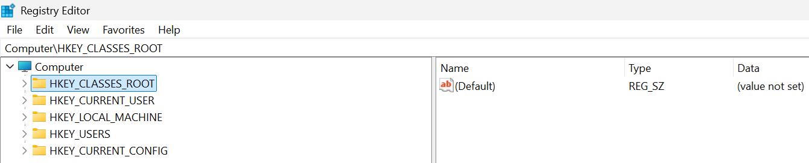
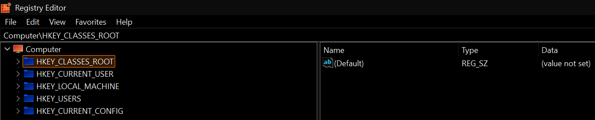

# Glare mute

Glare mute is a Windows accessibility app for people who need bright apps toned down without changing the rest of the desktop.

Currently available in English, Portuguese (Brazil), and Spanish.

## How to use

1. Open the app you want to apply the effect to.
2. Open Glare mute and pick that window from the list.
3. Choose **Invert** or **Greyscale Invert**.
4. Apply the effect.
5. Turn it off when you are done.

To affect apps running as administrator, Glare mute must also be launched as administrator. If it is already running from the tray, close it first and relaunch it with administrator permissions. This can matter for Windows tools such as Registry Editor (`regedit`) and other legacy administrative apps.

## Preview

A typical use case is a bright legacy Windows app that stays white even when the rest of the system is dark.

### Original

### Invert applied

## Platform support

- **Windows:** supported target platform for the current app
- **Other platforms:** not supported in the current release

## Install

Download the latest release from GitHub Releases.

- **Recommended:** use the Windows setup installer
- **Portable:** use the standalone `.exe`
- **Advanced/manual deployment:** use the `.msi`

**Windows security warning**  
Glare mute is currently unsigned, so Windows may show a SmartScreen warning before launch, even when downloaded from the official GitHub Releases page. The app is free and open source, but code signing for Windows releases is a paid requirement. If you trust the release, use **More info** -> **Run anyway**.

## Privacy and local processing

Glare mute is local software.

- no telemetry
- no analytics
- no account required
- no subscription
- no runtime dependency on external services
- window targeting and effect handling happen on your own machine

## License

GPL-3.0-only
