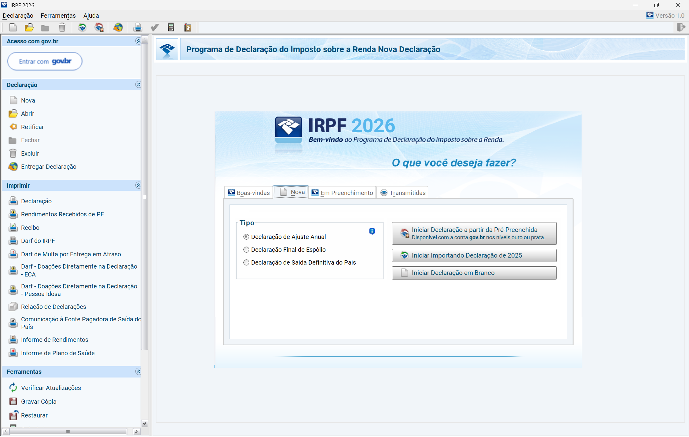
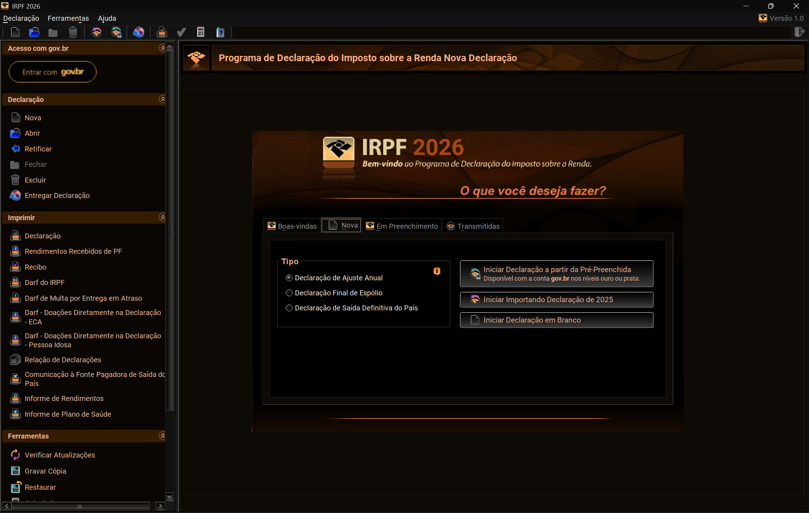

# Glare mute

Glare mute is a Windows accessibility app for people who need bright apps toned down without changing the rest of the desktop.

## What it does

- shows a live list of windows you can target
- applies **Invert** or **Greyscale Invert** to the selected window
- can keep the effect on related windows from the same app when that is reliable
- lets you turn the effect off quickly from the app or tray

## Current scope

Glare mute is currently focused on a narrow Windows v1:

- Windows desktop app
- real per-window effects for bright apps that ignore dark mode
- current built-in effects: **Invert** and **Greyscale Invert**

## Preview

A typical use case is a bright legacy tax app that stays white even when the rest of Windows is dark.

### Original

### Invert applied

## How to use

1. Open the app you want to soften.
2. Open Glare mute and pick that window from the list.
3. Choose **Invert** or **Greyscale Invert**.
4. Apply the effect.
5. Turn it off when you are done.

## Privacy and local processing

Glare mute is local software.

- no telemetry
- no analytics
- no account required
- no subscription
- no runtime dependency on external services
- window targeting and effect handling happen on your own machine

## Platform support

- **Windows:** supported target platform for the current app
- **Other platforms:** not supported in the current release scope

## Install

Download the latest release from GitHub Releases.

- **Recommended:** use the Windows setup installer
- **Portable:** use the standalone `.exe`
- **Advanced/manual deployment:** use the `.msi`

**Windows security warning**  
Glare mute is currently **unsigned**. The app is **free and open source**, but avoiding the **“Windows protected your PC” / “Unknown publisher”** warning for Windows releases still requires **paid code signing**. Because of that, Windows Defender SmartScreen may warn before launch even when you downloaded the app from the official GitHub Releases page. If you trust the release, use **More info → Run anyway**.

## Release status

Glare mute is an early Windows-first release focused on a narrow v1 scope.

## License

GPL-3.0-only
